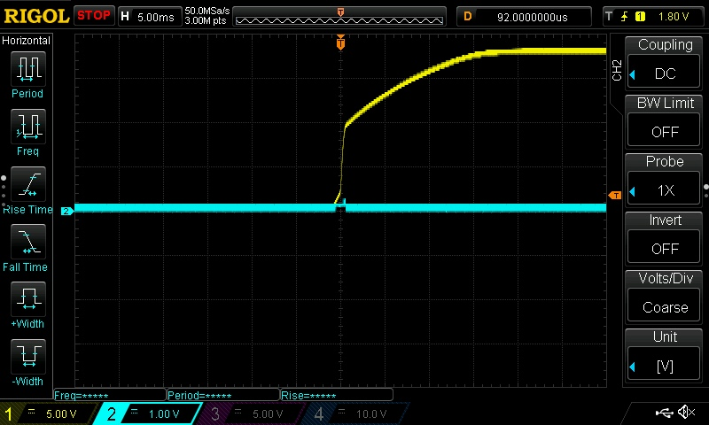

********************************
Dianome Power Distribution Board
********************************

Introduction
------------

Dianome is a Power Distribution Board (PDB) with enhanced safety features. It allows distribution from one XT-60 female connector to up to six XT-30 male connectors, a compact 4-layer PCB with standard 30,5 x 30,5mm screw hole pattern.

Dianome is based on the `LM5060 integrated high-side protection controller from TI <https://www.ti.com/lit/ds/symlink/lm5060-q1.pdf?ts=1631356182091>`_.

Inrush current limiting
-----------------------

Dianome provides inrush current limiting by driving the MOSFET through its ohmic region for a short time during startup. In the case of Tinymovr, this is designed to be in the range of a few milliseconds. In the image below the voltage transition downstream is depicted during startup

Enable Header
-------------

Dianome includes an Enable header. When the header is open (no jumper), the board is in standby mode, the MOSFET is not conducting, and no power is delivered downstream. When the header is closed (jumper installed), the board enters the enabled mode, the LM5060 will go through its startup procedure and enable the MOSFET. 

Aux Header
----------

Dianome includes an Aux header, which may be used to power electronics that require constant supply, regardless of Dianome's state. This header is supplied directly from the V+ rail and no protection is provided.